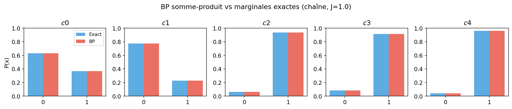
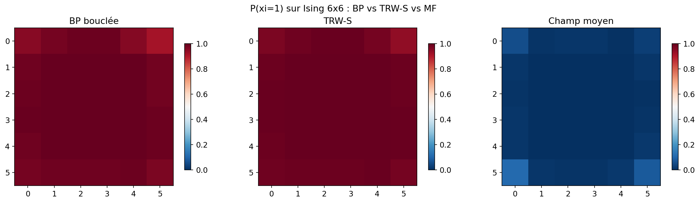
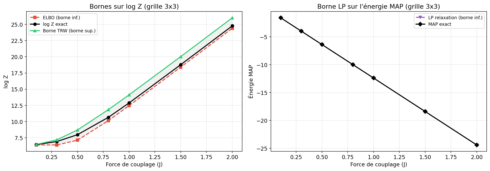
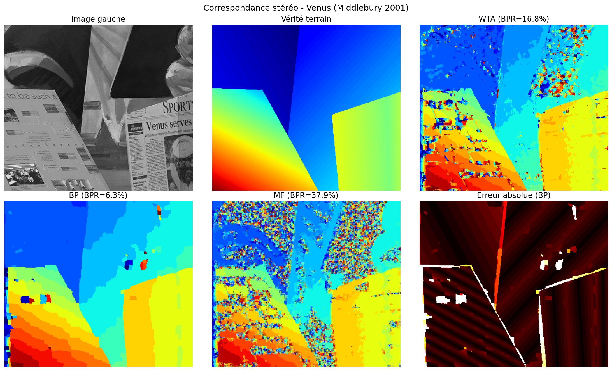
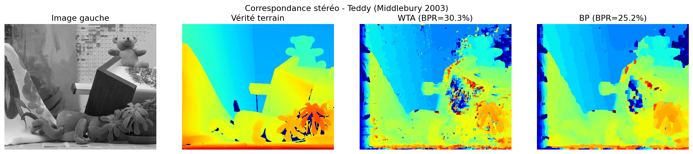

# Approximate Inference on Factor Graphs

Given a graph where each node is a discrete variable and each edge encodes a dependency between two variables, the goal is to compute marginal probabilities for each variable (inference) or find the most probable configuration (MAP). This is generally intractable, so we use approximate algorithms.

We implement and compare five methods:

- **Belief propagation (BP)**: message passing between nodes. Exact on trees, approximate on graphs with cycles (loopy BP with damping).
- **Max-product**: variant of BP that finds the MAP configuration instead of marginals.
- **TRW-S**: tree-reweighted message passing (Kolmogorov 2006). Provides an upper bound on log Z.
- **Mean field**: variational approximation that assumes variables are independent. Gives a lower bound on log Z (ELBO).
- **LP relaxation**: relaxes the MAP problem into a linear program. Gives a lower bound on the MAP energy.

We test on Ising models (2D grids) and apply the methods to stereo matching on the Middlebury benchmark.


## Experiments and Results

### 1-2. Exact BP and MAP on Trees

On a chain of 5 variables, BP recovers the exact marginals (error < 10^-10) and max-product identifies the correct MAP configuration.



### 3-4. BP, TRW-S, and Mean Field on Ising Grids

On a 6x6 grid with cycles, loopy BP without damping oscillates. Damping of 0.3-0.5 stabilizes convergence. BP and TRW-S capture spatial correlations well, while mean field produces beliefs that are too uniform.



### 5. Bounds on log Z and MAP Energy

We verify the sandwich ELBO <= log Z <= TRW bound on 3x3 grids, and the LP bound <= exact MAP energy. The gap grows with coupling strength.



### 6. Stereo Matching (Middlebury)

We formulate stereo matching as a grid MRF: each pixel chooses a disparity, and neighbors are encouraged to pick similar disparities. BP reduces the bad pixel rate from 17% to 7% on Venus and from 30% to 25% on Teddy.





| Image | Method | Bad pixels | MAE |
|---|---|---|---|
| Venus | WTA (no MRF) | ~17% | ~1.2 |
| Venus | BP (30 iter) | ~7% | ~0.7 |
| Teddy | WTA (no MRF) | ~30% | ~4.1 |
| Teddy | BP (15 iter) | ~25% | ~3.7 |


## Tests

**67 tests** using pytest, covering:

- Factor multiplication, marginalization, and normalization (17 tests)
- BP exact marginals on trees and max-product MAP (13 tests)
- TRW-S convergence, TRW bound >= log Z, LP bound <= MAP (12 tests)
- Vectorized grid algorithms (GridMRF) matching generic implementations (15 tests)
- Graph generators producing valid structures (10 tests)

```bash
pytest tests/ -v
```


## Project Structure

```
approximate-inference-on-factorial-graphs/
├── src/                    # Inference algorithms
├── tests/                  # 67 pytest tests
├── notebooks/              # Experiment notebook
├── benchmarking/           # Benchmarking scripts
├── figures/                # Generated figures
├── data/                   # Middlebury data
└── outputs/                # CSV results and generated plots
```


## Reproducing Results

```bash
pip install -e ".[dev]"
pytest tests/ -v
jupyter notebook notebooks/graphical_models.ipynb
```


## References

- Kschischang, Frey, Loeliger. "Factor Graphs and the Sum-Product Algorithm." *IEEE Trans. IT*, 2001.
- Pearl. *Probabilistic Reasoning in Intelligent Systems*. Morgan Kaufmann, 1988.
- Wainwright, Jordan. *Graphical Models, Exponential Families, and Variational Inference*. FnTML, 2008.
- Wainwright, Jaakkola, Willsky. "A New Class of Upper Bounds on the Log Partition Function." *IEEE Trans. IT*, 2005.
- Kolmogorov. "Convergent Tree-Reweighted Message Passing for Energy Minimization." *IEEE TPAMI*, 2006.
- Yedidia, Freeman, Weiss. "Constructing Free-Energy Approximations and Generalized BP Algorithms." *IEEE Trans. IT*, 2005.
- Blei, Kucukelbir, McAuliffe. "Variational Inference: A Review for Statisticians." *JASA*, 2017.
- Scharstein, Szeliski. "A Taxonomy and Evaluation of Dense Two-Frame Stereo Correspondence Algorithms." *IJCV*, 2002.
- Felzenszwalb, Huttenlocher. "Efficient Belief Propagation for Early Vision." *IJCV*, 2006.
